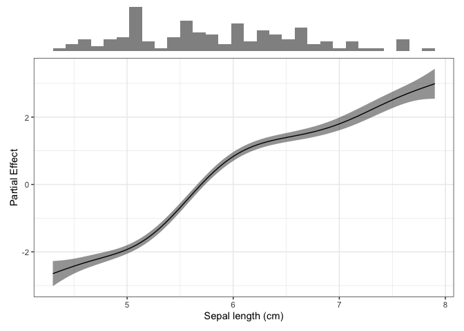
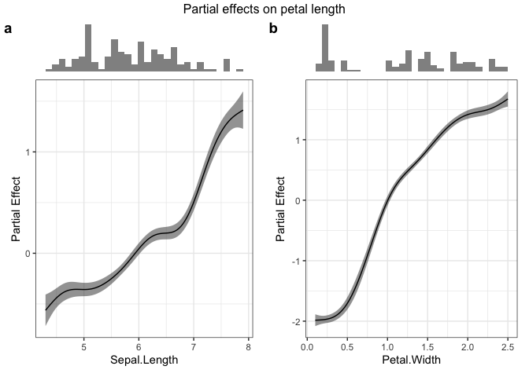
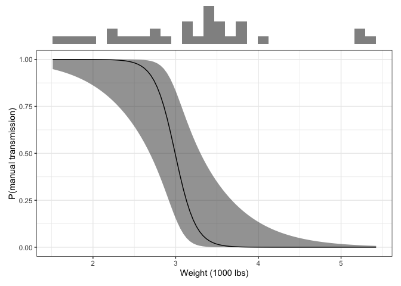

<!-- README.md is generated from README.Rmd. Please edit that file -->

# fancyfx

<!-- badges: start -->

[](https://github.com/chross22/fancyfx/actions/workflows/R-CMD-check.yaml)
<!-- badges: end -->

An effect curve on its own is easy to over-read. A model will happily
draw a confident-looking bend at the far right of the x axis, and
nothing in the plot tells you that only three observations sit under it.

`fancyfx` pairs every effect curve with a rug of the raw data, drawn
directly above it on a shared x axis, so the shape of the effect and the
weight of evidence behind it get read together.

It works across model types: GAMs fitted with `mgcv` are shown as
partial effects via `gratia`, and everything else as predictions via
`marginaleffects`.

> **Renamed from `fancygam`.** The package used to handle only GAMs.
> `plotSmooths()` still works and produces an identical plot, but is
> deprecated in favour of `plotEffects()` — same arguments, same output.
> See [Migrating](#migrating-from-fancygam).

## Installation

You can install the development version of fancyfx from
[GitHub](https://github.com/chross22/fancyfx) with:

``` r
# install.packages("devtools")
devtools::install_github("chross22/fancyfx")
```

## Example

``` r
library(fancyfx)

# A GAM, using the iris data set available in R
gam.fit <- mgcv::gam(Petal.Length ~ s(Sepal.Length), data = iris)

plotEffects(gam.fit, iris, "Sepal.Length", xlab = "Sepal length (cm)")
```



The histogram along the top is the point: where it is thin, be careful.

Several terms can be shown at once, each keeping its own rug:

``` r
gam.fit2 <- mgcv::gam(Petal.Length ~ s(Sepal.Length) + s(Petal.Width),
                      data = iris)

combinePlots(gam.fit2, iris, vars = c("Sepal.Length", "Petal.Width"),
             title = "Partial effects on petal length")
```



Non-GAM models take exactly the same call. Here a logistic regression,
on the scale of the outcome, with a 95% interval:

``` r
glm.fit <- glm(am ~ wt + hp, data = mtcars, family = binomial)

plotEffects(glm.fit, mtcars, "wt",
            scale = "response", interval = "ci",
            xlab = "Weight (1000 lbs)",
            ylab = "P(manual transmission)")
```



## Supported models

| Model | Backend | What you get |
|----|----|----|
| `mgcv::gam()`, `bam()` | `gratia` | Partial effect, link scale, centered |
| `lm()`, `glm()` | `marginaleffects` | Predicted values |
| Most other fitted models | `marginaleffects` | Predicted values |

Support beyond `lm`/`glm` comes from whatever `marginaleffects` handles,
and is being verified model family by model family — mixed models next,
then Bayesian fits.

### A caveat worth reading

The two backends compute **different quantities**. A partial effect is
one term’s contribution in isolation, centered so it averages to zero. A
predicted value is the model’s fitted output with the other predictors
held at representative values. `fancyfx` labels the y axis with
whichever it computed, and you should not compare them as though they
were on the same footing.

The default `interval = "se"` ribbon spans roughly 68%, not 95% — it is
this package’s historical default, kept so existing figures do not
silently change. Pass `interval = "ci"` for a conventional confidence
interval.

See `vignette("fancyfx")` for the full discussion.

## Migrating from fancygam

``` r
# Old:
plotSmooths(gam.fit, iris, "Sepal.Length")

# New — same arguments, same output:
plotEffects(gam.fit, iris, "Sepal.Length")
```

The defaults reproduce exactly what `plotSmooths()` drew for a GAM, so
migrating is a rename and nothing more.

## How to cite

``` r
citation("fancyfx")
```

`fancyfx` is a plotting layer over other people’s estimation work.
Please also cite whichever package computed your effects: `gratia` and
`mgcv` for GAM partial effects, `marginaleffects` otherwise.
