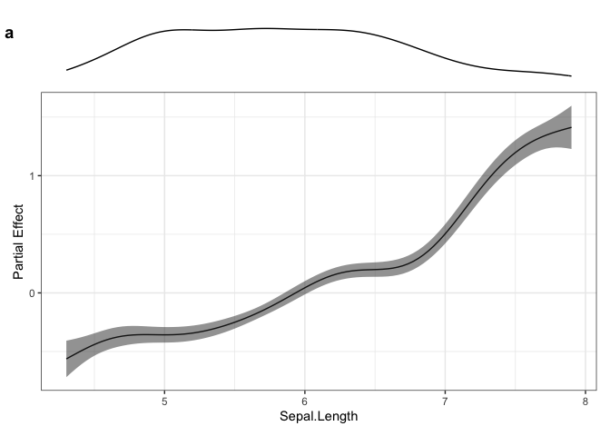
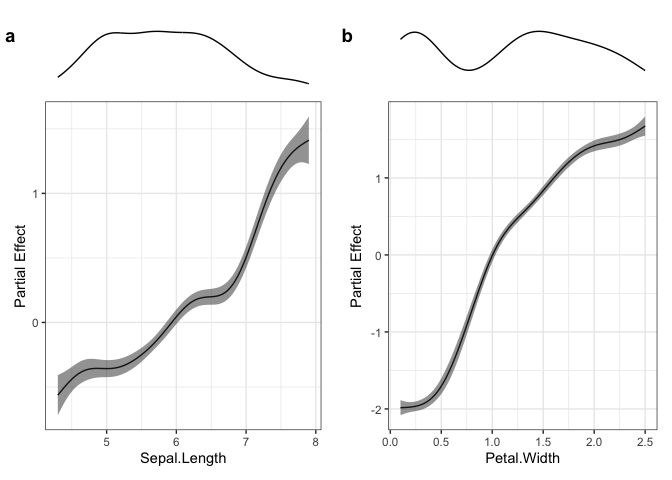

<!-- README.md is generated from README.Rmd. Please edit that file -->

# fancygam

<!-- badges: start -->

[](https://github.com/chross22/fancygam/actions/workflows/R-CMD-check.yaml)
<!-- badges: end -->

The goal of this package is to add flexibility when plotting GAMs
created using mgcv.

## Installation

You can install the development version of fancygam from
[GitHub](https://github.com/) with:

``` r
# install.packages("devtools")
devtools::install_github("chross22/fancygam")
```

## Example

Here is a very basic example of a use of fancygam, using the iris data
set available in R.

``` r
library(fancygam)

# Use Iris dataset
head(iris)
#>   Sepal.Length Sepal.Width Petal.Length Petal.Width Species
#> 1          5.1         3.5          1.4         0.2  setosa
#> 2          4.9         3.0          1.4         0.2  setosa
#> 3          4.7         3.2          1.3         0.2  setosa
#> 4          4.6         3.1          1.5         0.2  setosa
#> 5          5.0         3.6          1.4         0.2  setosa
#> 6          5.4         3.9          1.7         0.4  setosa

# Create example GAM using iris data
model <- mgcv::gam(Petal.Length ~ s(Sepal.Length) + s(Petal.Width), data = iris)

# Plot sepal length partial effects 
combinePlots(model, iris, vars = c("Sepal.Length"))
```



We can also plot multiple model terms next to one another using
fancygam.

``` r
# Plot both sepal length and petal width partial effects
combinePlots(model, iris, vars = c("Sepal.Length", "Petal.Width"))
```



## Citing fancygam

``` r
citation("fancygam")
```
