# Evaluating a model

``` r

library(fancyfx)
```

An effect plot says what a model claims. This vignette is about the
other question: whether to believe it.

Most of what follows is aimed at **presence/absence models** — the
species distribution case, where the response is whether something was
there. AUC, TSS and calibration are defined for a binary outcome and
nothing else, so applied to a Gaussian model of biomass they would
return a number with no meaning. `fancyfx` refuses that rather than
computing it. Permutation importance is the exception: it works for any
model.

There are three distinct questions here, and it is worth keeping them
apart:

| Question | Function |
|----|----|
| Does it rank presences above absences? | [`plotROC()`](https://camilleross.org/fancyfx/reference/plotROC.md) |
| Where should the cutoff go? | [`plotThreshold()`](https://camilleross.org/fancyfx/reference/plotThreshold.md) |
| Are the probabilities honest? | [`plotCalibration()`](https://camilleross.org/fancyfx/reference/plotCalibration.md) |
| Which predictors is it using? | [`plotImportance()`](https://camilleross.org/fancyfx/reference/plotImportance.md) |

The first three are not interchangeable. A model can rank perfectly and
still report probabilities that are wildly wrong.

## A worked example

``` r

set.seed(1)
d <- data.frame(x1 = runif(600, 1, 10),
                x2 = runif(600, 1, 10),
                x3 = runif(600, 1, 10))
# Only x1 carries any signal.
d$y <- rbinom(600, 1, plogis(-3 + 0.6 * d$x1))

train <- d[1:300, ]
test  <- d[301:600, ]

sdm <- glm(y ~ x1 + x2 + x3, data = train, family = binomial)
```

## The most important thing on this page

`newdata` is a **required** argument to every function here. There is no
default, and the default is not the training data.

That is deliberate. A model scored against the data it was fitted to
flatters itself, sometimes enormously, and an in-sample ROC curve can
look excellent for a model with no predictive value at all. Making that
the easiest figure to produce would be a disservice.

Passing the training data still works — refusing outright would be
obstructive, and sometimes it is genuinely what you want — but it warns,
and the figure is annotated so it cannot be quietly published as
validation:

``` r

plotROC(sdm, train, title = "Scored on the training data")
```

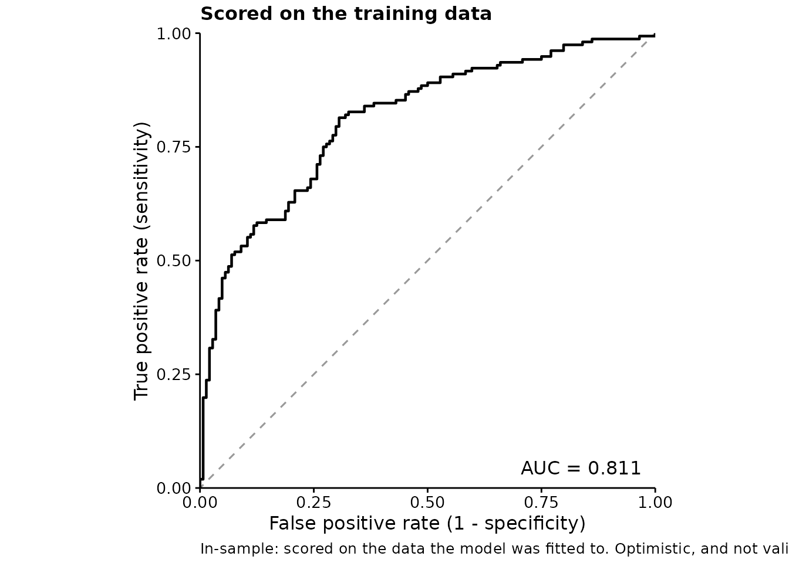

Read the caption. Compare it with the honest version:

``` r

plotROC(sdm, test, title = "Scored on held-out data")
```

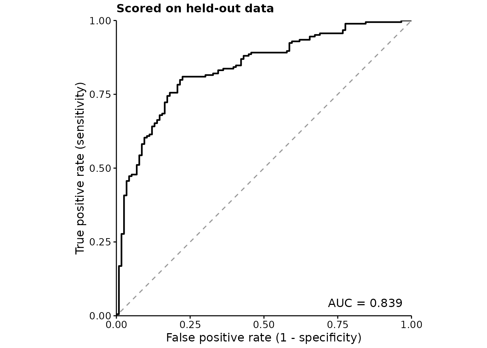

## Discrimination: the ROC curve

The ROC curve traces sensitivity against the false positive rate as the
decision threshold moves. The diagonal is chance. AUC summarises the
whole curve into the probability that a randomly chosen presence is
ranked above a randomly chosen absence.

`fancyfx` computes AUC from ranks — the Mann-Whitney form — rather than
by integrating the drawn curve, so tied predictions are handled exactly.
The curve itself is drawn as a step function, because that is what an
empirical ROC is; joining the corners would draw operating points the
model cannot reach.

The numbers are available on their own:

``` r

m <- threshold_metrics(sdm, test)

attr(m, "auc")
#> [1] 0.8389243
attr(m, "prevalence")
#> [1] 0.6133333
head(m, 3)
#>   .threshold .sensitivity .specificity        .tpr       .fpr         .tss
#> 1        Inf  0.000000000    1.0000000 0.000000000 0.00000000  0.000000000
#> 2  0.9463654  0.005434783    1.0000000 0.005434783 0.00000000  0.005434783
#> 3  0.9461274  0.005434783    0.9913793 0.005434783 0.00862069 -0.003185907
```

## Choosing a cutoff

AUC is threshold-free, which is its strength and its limitation: it says
how well the model ranks, and nothing about where to cut. For that:

``` r

plotThreshold(sdm, test)
```

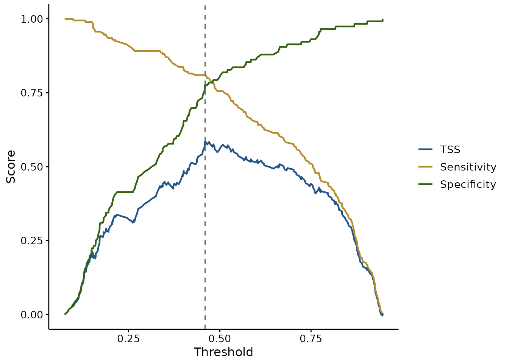

Sensitivity and specificity trade off against each other, and TSS
(Allouche et al. 2006) is their sum less one — so its peak, marked with
the dashed line, is the cutoff balancing them best. TSS is preferred to
raw accuracy in species distribution work because it is not inflated by
a rare positive class.

That peak is *one* defensible choice, not the only one. If a false
absence costs more than a false presence — a missed occurrence of
something you are trying to protect — then the right cutoff is not where
TSS peaks. Both curves are drawn so that judgement can be made rather
than assumed.

``` r

# TSS alone, without the curves it is built from
plotThreshold(sdm, test, metrics = "tss", mark.best = TRUE)
```

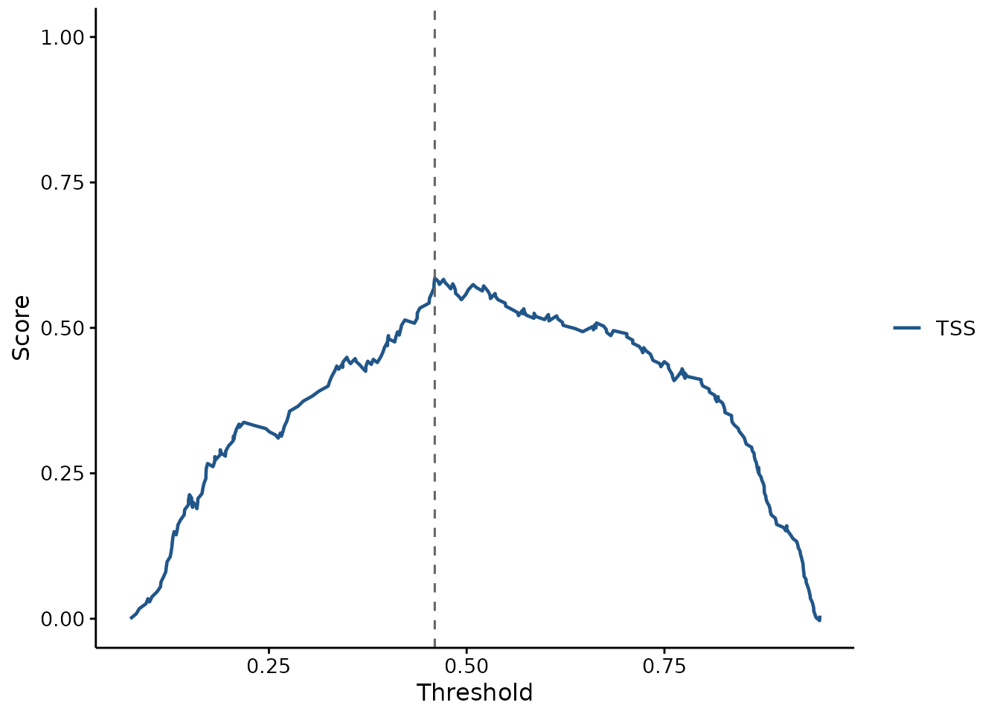

## Calibration: are the probabilities honest?

Discrimination and calibration are different properties, and a model can
be good at one and bad at the other.

AUC only cares whether presences are ranked above absences. That makes
it blind to any monotone rescaling of the predictions: a model can post
an excellent AUC while every probability it reports is far too extreme.
If those probabilities are only ever compared with each other, that may
not matter. If they feed a decision, an area of suitable habitat, or an
expected count, it matters a great deal.

``` r

plotCalibration(sdm, test)
```

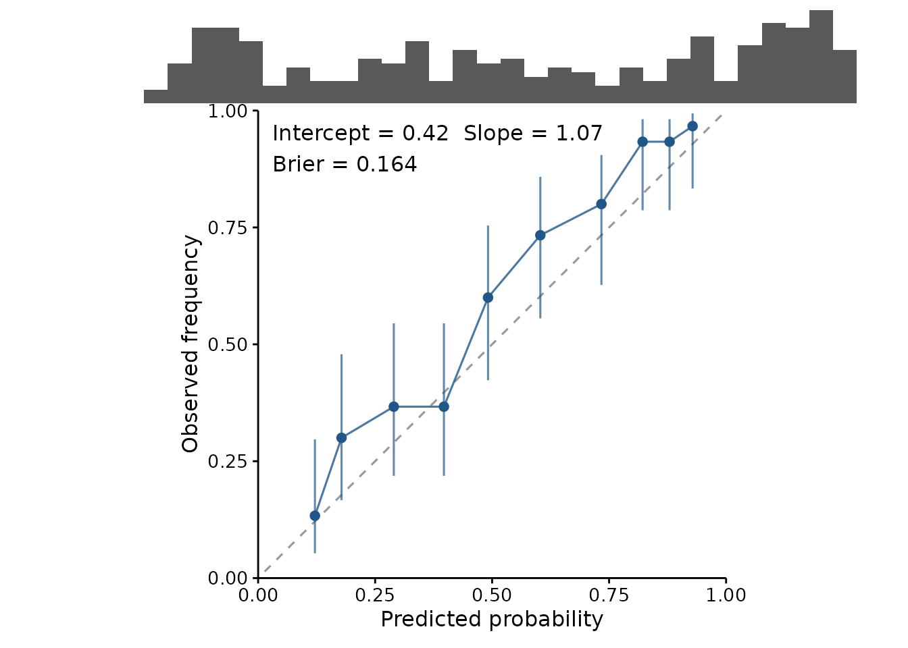

A well calibrated model sits on the diagonal: when it says 0.7, the
outcome happens about 70% of the time. The reported **slope** makes that
concrete — 1 is perfect, and below 1 means the predictions are too
extreme.

To see what a failure looks like, here is the same model with its
coefficients inflated. The ranking is untouched, so its AUC is
*identical*:

``` r

overconfident <- sdm
overconfident$coefficients <- overconfident$coefficients * 2.5

c(original = attr(threshold_metrics(sdm, test), "auc"),
  overconfident = attr(threshold_metrics(overconfident, test), "auc"))
#>      original overconfident 
#>     0.8389243     0.8389243

plotCalibration(overconfident, test, title = "Same AUC, useless probabilities")
```

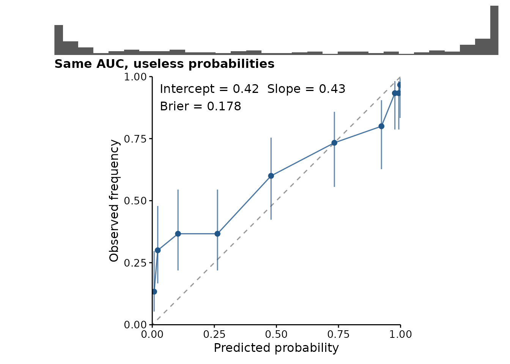

The curve is flatter than the diagonal and the rug has piled up against
0 and 1. AUC saw none of this.

### Reading the plot honestly

Two features of the plot exist to stop it being over-read:

- **The rug.** Calibration is usually worst at the extremes, and the
  extremes usually hold the fewest predictions — so the most
  eye-catching departures from the diagonal are often the least
  trustworthy points. The rug shows where the predictions actually are.
- **The interval on each bin**, which is a Wilson score interval rather
  than a normal approximation. With few observations in a bin, or an
  observed frequency near 0 or 1 — both routine here — the normal
  approximation puts the bounds outside `[0, 1]`, and a plot should not
  claim something impossible.

Binning is a genuine trade-off, exposed as `binning`. Quantile bins (the
default) hold equal numbers of observations, so every point is equally
reliable, at the cost of varying bin widths. Equal-width bins are easier
to read but leave the extremes nearly empty — precisely where the
interesting behaviour is.

``` r

plotCalibration(sdm, test, binning = "width", bins = 8)
```

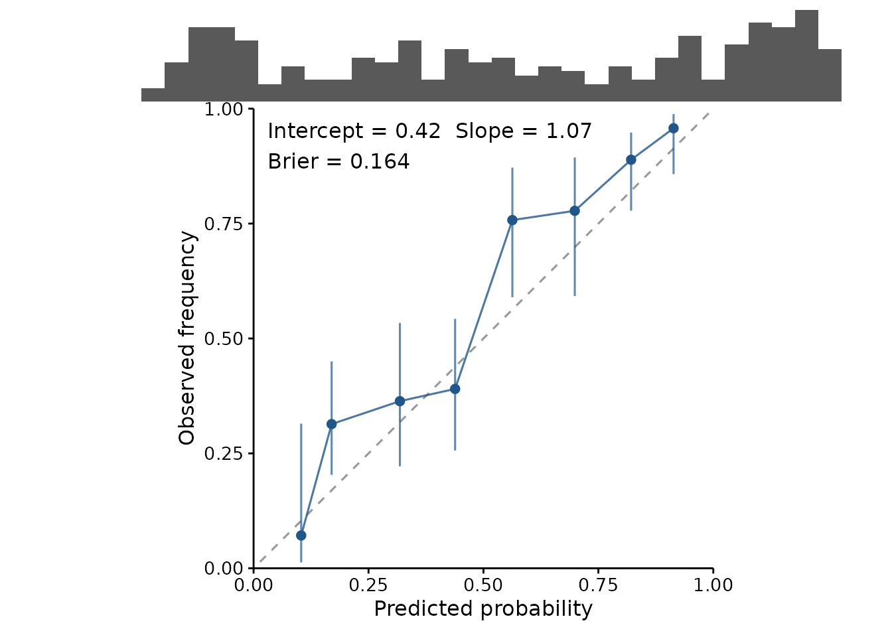

The numbers are available on their own, including the Brier score — the
mean squared error of the probabilities, covering calibration and
discrimination in one figure:

``` r

cal <- calibration_estimates(sdm, test)

attr(cal, "calibration")
#> intercept     slope 
#> 0.4210293 1.0709035
attr(cal, "brier")
#> [1] 0.1636824
head(cal, 3)
#>             .bin .predicted .observed     .lower    .upper .n
#> 1 [0.0748,0.152]  0.1213651 0.1333333 0.05309655 0.2968133 30
#> 2  (0.152,0.212]  0.1781950 0.3000000 0.16664748 0.4787579 30
#> 3  (0.212,0.352]  0.2899285 0.3666667 0.21873921 0.5448644 30
```

## Cross-validation, and why it is weaker

Folds are supported, and drawn per fold so the spread is visible rather
than averaged into a single reassuring number:

``` r

set.seed(2)
folds <- sample(rep(1:4, length.out = nrow(test)))

plotROC(sdm, test, folds = folds)
#> Scoring within cross-validation folds. Cross-validated metrics are weaker evidence than a genuinely independent hold-out: the folds come from the same sample, and the model saw the rest of it. For spatial data the gap is wider still, because a held-out point usually has a near neighbour in the training folds -- use spatially blocked folds rather than random ones, and read the spread across folds as the honest part of the picture.
```

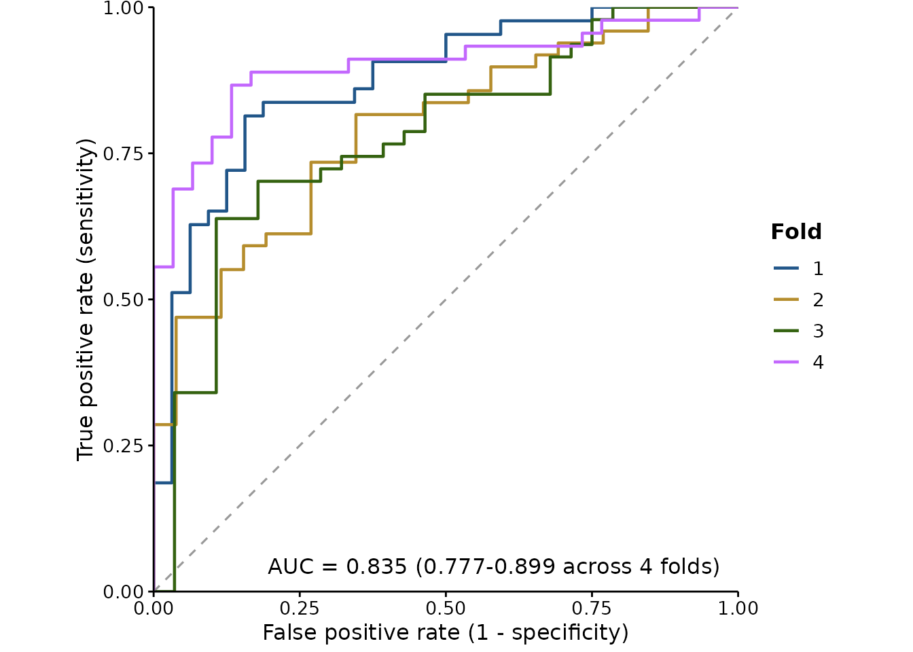

The first time you use `folds` in a session, the package says something
you should read. Cross-validated metrics are **weaker evidence than an
independent hold-out**: the folds come from the same sample, and the
model saw the rest of it. A cross-validated score speaks to how stable
the fit is, not to how it will behave somewhere new.

For spatial models the gap is wider still. With random folds, a held-out
point usually has a near neighbour among the training folds, so the
model has in effect already seen it, and the score is optimistic for
reasons that have nothing to do with the model being good. **Spatially
blocked folds** are the honest version — blocks of contiguous space held
out together, so the distance between training and testing data is real.
Packages such as `blockCV` generate them; pass the resulting fold IDs
straight in.

The spread across folds is the part worth reading. If the AUC range is
wide, or the TSS-maximising cutoff moves substantially between folds,
then reporting a single threshold to three decimal places is false
precision.

## Deviance

AUC only cares about ranking, so it cannot see predictions that are
ordered correctly and still wrong. Deviance can, and it penalises
confident mistakes hardest — usually the failure that matters.

``` r

predicted <- predict(sdm, test, type = "response")

fitted.deviance <- calc_deviance(test$y, predicted, "binomial")
null.deviance <- calc_deviance(test$y, rep(mean(test$y), nrow(test)),
                               "binomial")

# Proportion of deviance explained
1 - fitted.deviance / null.deviance
#> [1] 0.2527473
```

It is most useful as a relative measure. Against the null deviance —
what you would get predicting the overall mean for everything — the
ratio is the proportion of deviance explained, the number
boosted-regression-tree work reports as a matter of course. `family`
also takes `"poisson"`, `"gaussian"` and `"laplace"`, so it is not
restricted to presence/absence.

## How independent is the hold-out, really?

Everything above assumes the evaluation data tells you something the
training data did not.
[`spatial_sorting_bias()`](https://camilleross.org/fancyfx/reference/spatial_sorting_bias.md)
checks that assumption instead of taking it on faith.

The statistic is the ratio of two mean nearest-neighbour distances: from
each test presence to the closest training presence, over the same for
each test absence.

``` r

set.seed(1)
training <- cbind(runif(150, 0, 10), runif(150, 0, 10))

# A split whose presences sit on top of the training data
near <- cbind(runif(60, 0, 10), runif(60, 0, 10))
background <- cbind(runif(60, 0, 40), runif(60, 0, 40))

spatial_sorting_bias(near, background, training)
#>    presence     absence         ssb 
#>  0.38096261 19.08337421  0.01996306
```

Near 1 means the test presences and test absences are equally far from
the training data — the split is doing its job. Near 0 means the
presences are much closer, and a model can score well by knowing roughly
where the training data was without knowing anything about the species.
Its AUC is then measuring the split rather than the species.

This is what the cross-validation warnings elsewhere in the package are
about. They say the problem exists; this says how bad it is for a
particular split, which is the version worth putting in a methods
section. Pass `geo = TRUE` for longitude and latitude, and distances
become great-circle.

A low value is not a reason to throw the model away. It is a reason to
use spatially blocked folds, or to sample the test absences to match the
presences’ distance distribution — and then to say which you did.

## Predictions you already have

Everything above takes a fitted model and re-predicts. That keeps the
scored predictions and the model provably in step, but it assumes you
are holding a model that can reproduce them — and a cross-validated
workflow is not.

Under k-fold cross-validation, each observation is predicted by the one
fold model that never saw it. Those honest predictions live across `k`
models, none of which is the final fit. Re-predicting from the final
model on the same rows answers a different and more flattering question.

[`held_out()`](https://camilleross.org/fancyfx/reference/held_out.md) is
the way in for those. Wrap the observed outcomes and the predictions
that were actually made for them, and pass the result anywhere a model
would go:

``` r

set.seed(1)
truth <- rbinom(200, 1, 0.3)
score <- plogis(rnorm(200, ifelse(truth == 1, 1, -1)))

pairs <- held_out(truth, score)

attr(threshold_metrics(pairs), "auc")
#> [1] 0.9299906
```

``` r

plotROC(pairs, title = "Scored from stored cross-validated predictions")
```

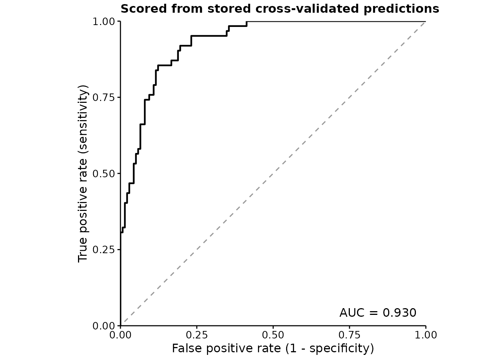

Two honest limits. It cannot verify the predictions are out of sample —
nothing in a pair of numeric vectors records which model made them — so
`in.sample` is taken on trust, and passing training predictions here
gets no warning, unlike the model path which inspects the fit. And it
cannot support
[`plotImportance()`](https://camilleross.org/fancyfx/reference/plotImportance.md),
which has to shuffle a predictor and re-predict; that needs a model by
construction, not a record of what one once said.

## Variable importance

Which predictors is the model actually leaning on?

``` r

plotImportance(sdm, test, n.perm = 20)
```

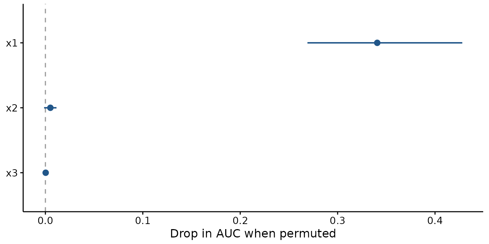

The measure is **permutation importance** (Breiman 2001): shuffle one
predictor, breaking its relationship with the response while leaving its
distribution intact, and see how much worse the model scores. For a
binary response the metric is the drop in AUC; otherwise the increase in
RMSE. Either way, bigger means the model was relying on it more.

It is model-agnostic — it needs nothing but the ability to predict — so
a GAM, a GLM, a mixed model and a Bayesian fit all give numbers that
mean the same thing and can be compared.

[`permutation_importance()`](https://camilleross.org/fancyfx/reference/permutation_importance.md)
gives the numbers behind the plot — one row per variable per
permutation, so you can summarise them your own way:

``` r

imp <- permutation_importance(sdm, test, n.perm = 20)

aggregate(.importance ~ .variable, data = imp, FUN = mean)
#>   .variable  .importance
#> 1        x1 0.3406695090
#> 2        x2 0.0051021364
#> 3        x3 0.0002811094
attr(imp, "metric")
#> [1] "auc"
```

The point is drawn at the mean and the line spans the permutations. The
**spread is the point**: a variable whose range crosses the dashed zero
line did no measurable work, and a bar chart of means would hide that.
Here `x1` is doing everything and `x2` and `x3` are doing nothing, which
is exactly how the data were simulated.

Because permutation is random, results are seeded by default — an
unseeded figure cannot be redrawn. The caller’s random stream is
restored afterwards, so this does not silently change results elsewhere
in your script.

### Two things it does not tell you

**Correlated predictors share credit badly.** If two variables carry
much the same information, permuting either one alone barely hurts,
because the other still carries it. Both look unimportant and the pair
is not. This bites hard on environmental covariates, which are routinely
collinear — sea surface temperature and depth, say. If a variable you
expect to matter shows near-zero importance, check what it is correlated
with before concluding anything.

**It measures use, not effect size.** A variable can be important here
and have an effect too small to care about, or the reverse. Read it
beside
[`plotEffects()`](https://camilleross.org/fancyfx/reference/plotEffects.md),
not instead of it:

``` r

ggpubr::ggarrange(
  plotImportance(sdm, test, n.perm = 20),
  plotEffects(sdm, train, "x1", scale = "response",
              ylab = "P(presence)"),
  labels = c("A", "B"), widths = c(1, 1.1)
)
```

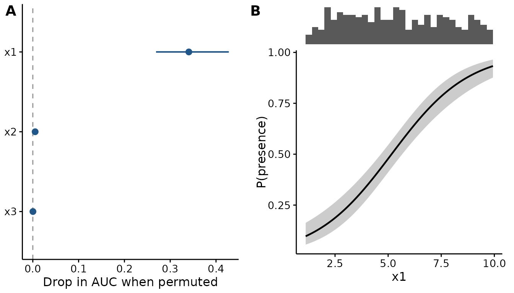

## Putting it in a paper

Everything here uses the same theme, palette and panel machinery as the
effect plots, so an evaluation figure and an effect figure sit together
without adjustment. See the “Publication-ready output” section of
[`vignette("fancyfx")`](https://camilleross.org/fancyfx/articles/fancyfx.md)
for `base_size`, panel labels and saving at a fixed size.

## References

Allouche, Omri, Asaf Tsoar, and Ronen Kadmon. 2006. “Assessing the
Accuracy of Species Distribution Models: Prevalence, Kappa and the True
Skill Statistic (TSS).” *Journal of Applied Ecology* 43 (6): 1223–32.
<https://doi.org/10.1111/j.1365-2664.2006.01214.x>.

Breiman, Leo. 2001. “Random Forests.” *Machine Learning* 45 (1): 5–32.
<https://doi.org/10.1023/A:1010933404324>.
