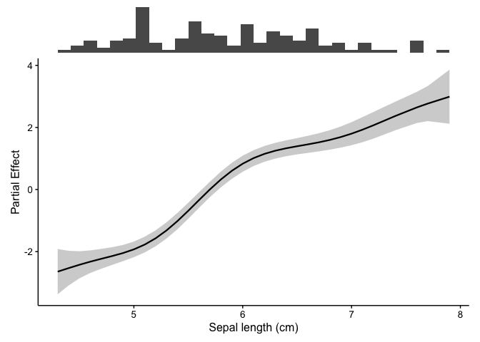
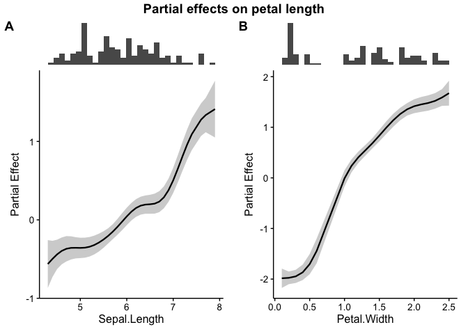
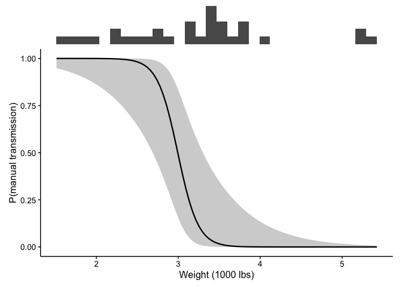
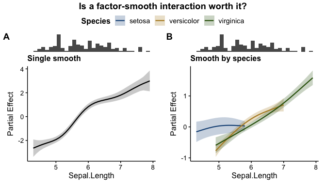
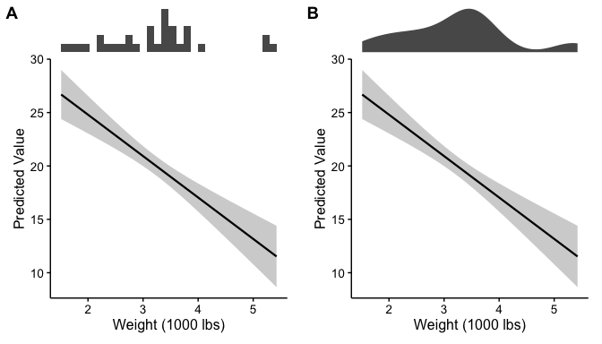
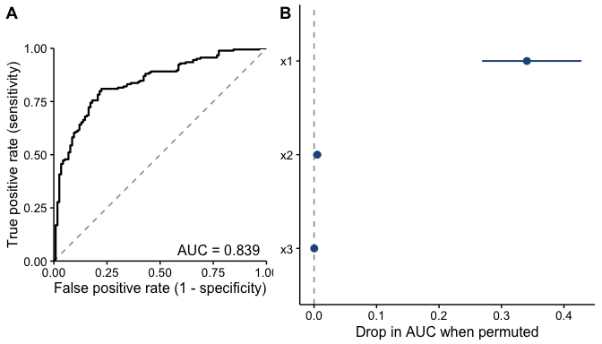
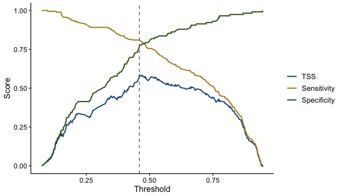
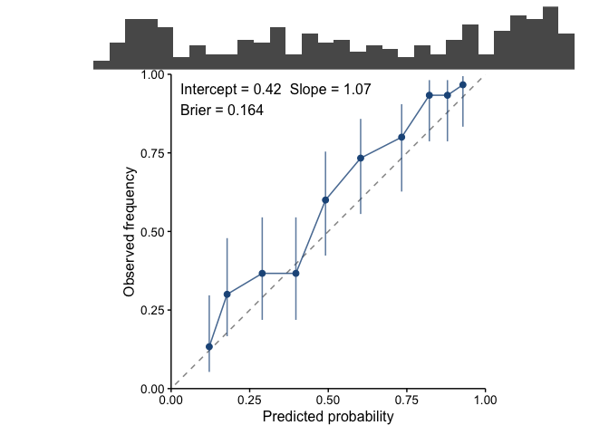
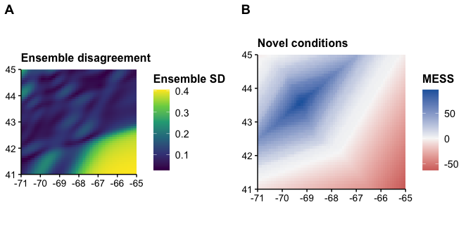

# fancyfx

An effect curve on its own is easy to over-interpret. A model could draw
a confident-looking bend at the far right of the x axis, and nothing in
the plot would tell you that only three observations sit under it.

`fancyfx` pairs every effect curve with a rug of the raw data, drawn
directly above it on a shared x axis, so the shape of the effect and the
weight of evidence behind it get read together. Additionally, `fancyfx`
returns manuscript ready figures without having to fiddle with settings.
Defaults are chosen for publication rather than for exploration — a
clean theme with no grid or background panel, lettered panel labels, and
a categorical palette checked for legibility under colour vision
deficiency — so a bare call gets you close to the figure you would
submit. Every one of those is an argument, so a house style can replace
any of them.

It works across model types: GAMs fitted with `mgcv` are shown as
partial effects via `gratia`, and everything else — including mixed and
Bayesian fits — as predictions via `marginaleffects`.

Alongside the effect plots are **model evaluation plots** — ROC/AUC, the
TSS-versus-threshold trade-off, and permutation importance — which ask
whether the model earns the effects it reports.

## Which function do I want?

| I want to… | Use |
|----|----|
| plot one predictor’s effect | [`plotEffects()`](https://camilleross.org/fancyfx/reference/plotEffects.md) |
| plot several predictors | [`combinePlots()`](https://camilleross.org/fancyfx/reference/combinePlots.md) |
| compare competing models | [`comparePlots()`](https://camilleross.org/fancyfx/reference/comparePlots.md) |
| get the effect numbers, not a plot | [`effect_estimates()`](https://camilleross.org/fancyfx/reference/effect_estimates.md) |
| draw a rug on its own | [`plotRugs()`](https://camilleross.org/fancyfx/reference/plotRugs.md) |
| **evaluate a presence/absence model** |  |
| how well does it rank? | [`plotROC()`](https://camilleross.org/fancyfx/reference/plotROC.md) |
| where should the cutoff go? | [`plotThreshold()`](https://camilleross.org/fancyfx/reference/plotThreshold.md) |
| are the probabilities honest? | [`plotCalibration()`](https://camilleross.org/fancyfx/reference/plotCalibration.md) |
| which predictors is it using? | [`plotImportance()`](https://camilleross.org/fancyfx/reference/plotImportance.md) |
| how much deviance is explained? | [`calc_deviance()`](https://camilleross.org/fancyfx/reference/calc_deviance.md) |
| is my hold-out actually independent? | [`spatial_sorting_bias()`](https://camilleross.org/fancyfx/reference/spatial_sorting_bias.md) |
| score predictions I already have (CV) | [`held_out()`](https://camilleross.org/fancyfx/reference/held_out.md) |
| **spatial projections** |  |
| where does the ensemble disagree? | [`plotUncertainty()`](https://camilleross.org/fancyfx/reference/plotUncertainty.md) |
| where is it extrapolating? | [`plotExtrapolation()`](https://camilleross.org/fancyfx/reference/plotExtrapolation.md) |
| aggregate to a defensible resolution | [`plotHexbin()`](https://camilleross.org/fancyfx/reference/plotHexbin.md) / [`hex_bin()`](https://camilleross.org/fancyfx/reference/hex_bin.md) |
| thin records clustered by survey effort | [`thin_points()`](https://camilleross.org/fancyfx/reference/thin_points.md) |
| do two distributions overlap? | [`niche_overlap()`](https://camilleross.org/fancyfx/reference/niche_overlap.md) / [`niche_equivalency()`](https://camilleross.org/fancyfx/reference/niche_equivalency.md) |
| **make it publication-ready** |  |
| change the theme or font sizes | [`theme_fancyfx()`](https://camilleross.org/fancyfx/reference/theme_fancyfx.md) |
| change the curve colours | [`fancyfx_palette()`](https://camilleross.org/fancyfx/reference/fancyfx_palette.md) |

## Installation

You can install the development version of fancyfx from
[GitHub](https://github.com/chross22/fancyfx) with:

``` r

# install.packages("devtools")
devtools::install_github("chross22/fancyfx")
```

## Example

``` r

library(fancyfx)

# A GAM, using the iris data set available in R
gam.fit <- mgcv::gam(Petal.Length ~ s(Sepal.Length), data = iris)

plotEffects(gam.fit, iris, "Sepal.Length", xlab = "Sepal length (cm)")
```



The histogram along the top is the point: where it is thin, be careful.

Several terms can be shown at once, each keeping its own rug:

``` r

gam.fit2 <- mgcv::gam(Petal.Length ~ s(Sepal.Length) + s(Petal.Width),
                      data = iris)

combinePlots(gam.fit2, iris, vars = c("Sepal.Length", "Petal.Width"),
             title = "Partial effects on petal length")
```



Non-GAM models take exactly the same call. Here a logistic regression,
on the scale of the outcome, with a 95% interval:

``` r

glm.fit <- glm(am ~ wt + hp, data = mtcars, family = binomial)

plotEffects(glm.fit, mtcars, "wt",
            scale = "response", interval = "ci",
            xlab = "Weight (1000 lbs)",
            ylab = "P(manual transmission)")
```



## Comparing models

[`comparePlots()`](https://camilleross.org/fancyfx/reference/comparePlots.md)
holds the variable fixed and varies the *model*, which is how you check
whether a modelling choice bought you anything. A factor-smooth
interaction is drawn as one curve per level, with a colourblind-safe
palette and a legend:

``` r

plain <- mgcv::gam(Petal.Length ~ s(Sepal.Length), data = iris)
by.species <- mgcv::gam(Petal.Length ~ s(Sepal.Length, by = Species) + Species,
                        data = iris)

comparePlots(list("Single smooth" = plain,
                  "Smooth by species" = by.species),
             iris, "Sepal.Length",
             title = "Is a factor-smooth interaction worth it?")
```



## Rug styles

`rug.type` picks how the raw data is summarised above the curve. A
histogram shows counts and reads well at moderate sample sizes; a
density is smoother and works better when a histogram would be noisy.

``` r

lm.fit <- lm(mpg ~ wt + hp, data = mtcars)

ggpubr::ggarrange(
  plotEffects(lm.fit, mtcars, "wt", rug.type = "histogram",
              xlab = "Weight (1000 lbs)"),
  plotEffects(lm.fit, mtcars, "wt", rug.type = "density",
              xlab = "Weight (1000 lbs)"),
  labels = c("A", "B")
)
```



## Publication-ready by default

Plots use
[`theme_fancyfx()`](https://camilleross.org/fancyfx/reference/theme_fancyfx.md),
built on
[`ggpubr::theme_pubr()`](https://rpkgs.datanovia.com/ggpubr/reference/theme_pubr.html):
no background panel, no grid, plain axis lines, and text sized to
survive being shrunk into a column. Panels are labelled `A`, `B`, `C` by
default.

``` r

# Bigger text for a narrow figure — scales every element together
plotEffects(fit, dat, "x", theme = theme_fancyfx(base_size = 16))

# Or size each element on its own
plotEffects(fit, dat, "x",
            theme = theme_fancyfx(base_size = 13,
                                  axis.title.size = 18,
                                  axis.text.size = 10,
                                  legend.title.size = 15))

# Panel labels and the figure title are drawn by the arranging step,
# so they have their own arguments
combinePlots(fit, dat, vars, title = "...", label.size = 20, title.size = 18)

# Lower-case, numbered, none, or your own
combinePlots(fit, dat, vars, labels = "a")
combinePlots(fit, dat, vars, labels = "1")
combinePlots(fit, dat, vars, labels = "none")
combinePlots(fit, dat, vars, labels = c("Panel one", "Panel two"))

# Any other ggplot2 theme works too
plotEffects(fit, dat, "x", theme = ggplot2::theme_minimal())
```

Curves that split by a factor use
[`fancyfx_palette()`](https://camilleross.org/fancyfx/reference/fancyfx_palette.md),
a six-colour categorical palette chosen by search rather than by eye:
every colour sits in a mid lightness band, clears 3:1 contrast against a
white page, and stays separable under simulated protanopia and
deuteranopia.

## Evaluating a model

Effect plots say what a model claims. These say whether to believe it.

For presence/absence models,
[`plotROC()`](https://camilleross.org/fancyfx/reference/plotROC.md)
covers discrimination,
[`plotThreshold()`](https://camilleross.org/fancyfx/reference/plotThreshold.md)
covers where to cut, and
[`plotCalibration()`](https://camilleross.org/fancyfx/reference/plotCalibration.md)
covers whether the probabilities are honest.
[`plotImportance()`](https://camilleross.org/fancyfx/reference/plotImportance.md)
covers which predictors the model is actually leaning on, for any model
type.

``` r

set.seed(1)
d <- data.frame(x1 = runif(600, 1, 10), x2 = runif(600, 1, 10),
                x3 = runif(600, 1, 10))
d$y <- rbinom(600, 1, plogis(-3 + 0.6 * d$x1))
train <- d[1:300, ]
test  <- d[301:600, ]

sdm <- glm(y ~ x1 + x2 + x3, data = train, family = binomial)

ggpubr::ggarrange(
  plotROC(sdm, test),
  plotImportance(sdm, test, n.perm = 20),
  labels = c("A", "B"), widths = c(1, 1.2)
)
```



A ROC curve says how well the model *ranks*; it does not tell you where
to cut.
[`plotThreshold()`](https://camilleross.org/fancyfx/reference/plotThreshold.md)
does — sensitivity and specificity against the cutoff, with the
TSS-maximising threshold marked:

``` r

plotThreshold(sdm, test)
```



And neither says whether the probabilities themselves are *honest*.
[`plotCalibration()`](https://camilleross.org/fancyfx/reference/plotCalibration.md)
does: a model that says 0.7 should be right about 70% of the time.

``` r

plotCalibration(sdm, test)
```



Discrimination and calibration are genuinely separate questions, and AUC
cannot answer the second: it only cares about ranking, so it is
unchanged by any monotone rescaling — a model can post an excellent AUC
while every probability it reports is far too extreme. The reported
slope makes it concrete: 1 is perfect, below 1 means over-confident.

Note the rug. Calibration is usually worst at the extremes, and the
extremes usually hold the fewest predictions, so the most eye-catching
departures from the diagonal are often the least trustworthy points on
the plot.

Three defaults here are deliberate. **`newdata` is required**, and
passing the training data warns and annotates the figure as in-sample —
an in-sample ROC can look excellent for a model with no predictive
value, and the easiest figure to produce should not be the misleading
one. **Folds are drawn per fold** rather than averaged, and come with a
note, because cross-validated metrics are weaker evidence than an
independent hold-out — for spatial models, use spatially blocked folds.
And
**[`spatial_sorting_bias()`](https://camilleross.org/fancyfx/reference/spatial_sorting_bias.md)**
says how far a split falls short of independence: near 1 it is doing its
job, near 0 the test presences sit so close to the training data that
AUC is measuring the split rather than the species.

Two limits the functions state themselves: AUC and TSS are defined for
**binary outcomes only**, and permutation importance **splits credit
badly between correlated predictors**, which bites hard on environmental
covariates.

→ [**Evaluating a
model**](https://camilleross.org/fancyfx/vignettes/evaluation.Rmd)
covers all of it, plus deviance, variable importance, and how to put it
in a paper.

## Spatial projections

A projection map is a persuasive object. It fills the study area with
colour, looks identical whether the model had a thousand observations in
a region or none, and nothing on it separates the part built on evidence
from the part built on the model’s willingness to keep predicting.

Two maps put that distinction back. `terra` is a suggested package, so
nothing here is installed for users who never project.

``` r

library(terra)
#> terra 1.9.34

set.seed(1)
grid <- rast(nrows = 50, ncols = 65, xmin = -71, xmax = -65,
             ymin = 41, ymax = 45, crs = "EPSG:4326")
lon <- init(grid, "x"); lat <- init(grid, "y")

sst <- 14 - 1.2 * (lat - 41) + 0.3 * (lon + 71); names(sst) <- "sst"
depth <- 20 + 30 * (lon + 71) + 25 * (45 - lat); names(depth) <- "depth"
covariates <- c(sst, depth)

# A survey covering only the north-west of the domain
points <- data.frame(lon = runif(400, -71, -67.5), lat = runif(400, 42, 45))
survey <- cbind(points, extract(covariates, points, ID = FALSE))
survey$present <- rbinom(400, 1,
                         plogis(-4 + 0.45 * survey$sst - 0.01 * survey$depth))

# A bootstrap ensemble of projections
ensemble <- rast(lapply(1:6, function(i) {
  refit <- mgcv::gam(present ~ s(sst) + s(depth),
                     data = survey[sample(nrow(survey), replace = TRUE), ],
                     family = binomial)
  terra::predict(covariates, refit, type = "response")
}))

ggpubr::ggarrange(
  plotUncertainty(ensemble, title = "Ensemble disagreement"),
  plotExtrapolation(covariates, survey, title = "Novel conditions"),
  labels = c("A", "B")
)
```



The south-east is both where the ensemble disagrees most **and** where
the projection has left the surveyed envelope — the honest reading being
that the model has nothing to say about it.

[`plotExtrapolation()`](https://camilleross.org/fancyfx/reference/plotExtrapolation.md)
draws a MESS surface: below zero, a cell is outside the training range
of at least one covariate. It works one covariate at a time, so it
cannot see novel *combinations* of individually ordinary values — treat
a clean surface as the absence of one specific problem, not permission
to project.

Also here:
[`hex_bin()`](https://camilleross.org/fancyfx/reference/hex_bin.md) and
[`plotHexbin()`](https://camilleross.org/fancyfx/reference/plotHexbin.md)
aggregate a raster or point data into a hexagonal lattice;
[`thin_points()`](https://camilleross.org/fancyfx/reference/thin_points.md)
thins records where clustering reflects survey effort rather than the
species; and
[`niche_overlap()`](https://camilleross.org/fancyfx/reference/niche_overlap.md)
with
[`niche_equivalency()`](https://camilleross.org/fancyfx/reference/niche_equivalency.md)
compare two predicted distributions against a randomisation null.

→ [**Spatial
projections**](https://camilleross.org/fancyfx/vignettes/spatial.Rmd)
covers large rasters, hexagonal binning, thinning uneven effort, and
comparing two distributions.

## Supported models

| Model | Backend | What you get |
|----|----|----|
| [`mgcv::gam()`](https://rdrr.io/pkg/mgcv/man/gam.html), `bam()` | `gratia` | Partial effect, link scale, centered |
| [`gamm4::gamm4()`](https://rdrr.io/pkg/gamm4/man/gamm4.html), [`mgcv::gamm()`](https://rdrr.io/pkg/mgcv/man/gamm.html) | `gratia` | Partial effect, population level |
| [`scam::scam()`](https://rdrr.io/pkg/scam/man/scam.html) | `gratia` | Partial effect, shape constraint preserved |
| [`lm()`](https://rdrr.io/r/stats/lm.html), [`glm()`](https://rdrr.io/r/stats/glm.html) | `marginaleffects` | Predicted values |
| [`lme4::lmer()`](https://rdrr.io/pkg/lme4/man/lmer.html), `glmer()` | `marginaleffects` | Predicted values, population level |
| [`glmmTMB::glmmTMB()`](https://rdrr.io/pkg/glmmTMB/man/glmmTMB.html) | `marginaleffects` | Predicted values, population level |
| [`brms::brm()`](https://paulbuerkner.com/brms/reference/brm.html) | `marginaleffects` | Predicted values, credible interval |
| [`rstanarm::stan_glm()`](https://mc-stan.org/rstanarm/reference/stan_glm.html), `stan_glmer()` | `marginaleffects` | Predicted values, credible interval |
| Most other fitted models | `marginaleffects` | Predicted values |

Support beyond those comes from whatever `marginaleffects` handles; the
rows above are the families verified against real fits.

The two backends compute **different quantities**, and this is the
caveat worth reading. A partial effect is one term’s contribution in
isolation, centered so it averages to zero. A predicted value is the
model’s fitted output with the other predictors held at representative
values. `fancyfx` labels the y axis with whichever it computed, and they
should not be compared as though they were on the same footing.

Everything in the GAM family reports a partial effect by default, so
those rows are comparable with each other — `scam` and `gamm4`/`gamm`
only because the package intervenes to unwrap them. Bayesian fits are
summarised from posterior draws, so the ribbon is a credible interval
and there is no `±1 SE` to be had. For a mixed model `re.form` defaults
to `NA`, so the effect is drawn at the population level rather than for
one arbitrary group.

The default ribbon is a **95% pointwise interval**, matching
[`mgcv::plot.gam()`](https://rdrr.io/pkg/mgcv/man/plot.gam.html) and
[`gratia::draw()`](https://gavinsimpson.github.io/gratia/reference/draw.html).
Until 0.10.0 this package drew ±1 SE — roughly 68%, half the width, and
a width most readers would assume was 95%. Pass `interval = "se"` for
that narrower band, or `interval = "simultaneous"` on a GAM smooth.

→ [**Getting
started**](https://camilleross.org/fancyfx/vignettes/fancyfx.Rmd) has
the full discussion.

## Migrating from plotSmooths()

``` r

# Old:
plotSmooths(gam.fit, iris, "Sepal.Length")

# New — same arguments, same output:
plotEffects(gam.fit, iris, "Sepal.Length")
```

The defaults reproduce exactly what
[`plotSmooths()`](https://camilleross.org/fancyfx/reference/plotSmooths.md)
drew for a GAM, so migrating is a rename and nothing more.

## Why it does what it does

Several defaults here are deliberate rather than conventional —
evaluation data being required, `re.form = NA` for mixed models,
`na.rm = FALSE` when summarising an ensemble, the choice of a 95% ribbon
over `±1 SE`. Each has a reason, and the reasons are gathered in
[DECISIONS.md](https://camilleross.org/fancyfx/DECISIONS.md) with the
measurements behind them, so a choice can be looked up and defended
without hunting through help pages.

## Documentation

|  |  |
|----|----|
| [Getting started](https://camilleross.org/fancyfx/vignettes/fancyfx.Rmd) | effect plots, the backends, and what the ribbon means |
| [Evaluating a model](https://camilleross.org/fancyfx/vignettes/evaluation.Rmd) | ROC, thresholds, calibration, deviance, importance |
| [Spatial projections](https://camilleross.org/fancyfx/vignettes/spatial.Rmd) | uncertainty and extrapolation maps, hexbins, thinning |

## How to cite

``` r

citation("fancyfx")
```

`fancyfx` is a plotting layer over other people’s estimation work.
Please also cite whichever package computed your effects: `gratia` and
`mgcv` for GAM partial effects, `marginaleffects` otherwise.
